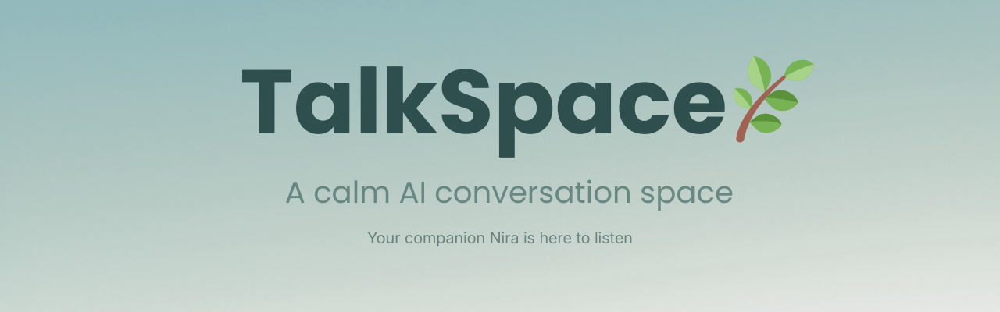

<p align="center">
  
</p>

<p align="center">
  A quiet digital space where people can share what’s on their mind.
</p>

<p align="center">
  <b>🌿 Your companion Nira is here to listen.</b>
</p>

---

## 🚀 Live Demo

👉 **Try TalkSpace:**
https://mental-health-analyser-ai.streamlit.app/

---

## 🏷 Tech Badges

<p align="center">


</p>

---

# 🌱 The Idea

TalkSpace is designed to be a **calm digital environment for conversation**.

Many AI chat systems focus on answering questions quickly.
TalkSpace focuses on something different:

> Helping people feel heard.

The system tries to behave more like a **supportive listener** than a typical chatbot.

It reflects emotions, asks gentle questions, and offers calming suggestions.

---

# ✨ Features

### 🌿 AI Companion – Nira

A conversation companion designed to respond with warmth and understanding.

Users can switch between:

• **Supportive Friend Mode**
• **Counselor Mode**

---
## 🧠 System Architecture

TalkSpace uses a hybrid approach combining **machine learning classification** with **rule-based conversation design**.

### Pipeline

User Input → Text Vectorization → ML Prediction → Emotion Detection → Response Generation → Conversation Memory Update

### Core Components

**1. Text Vectorization**

User messages are converted into numerical representations using a trained vectorizer.

* TF-IDF vectorization
* Sparse text feature representation

---

**2. Depression Signal Classifier**

A trained machine learning model estimates emotional intensity from the input text.

Model output:

* probability score of emotional distress
* used to guide response strategy

---

**3. Emotion Detection Layer**

A lightweight keyword-based signal detection identifies emotional themes:

* loneliness
* sadness
* anxiety
* stress
* social conflict
* self-worth issues

These signals help shape the tone of the response.

---

**4. Response Strategy Engine**

The response generator combines:

* validation phrases
* supportive messages
* reflective questions
* grounding suggestions

The system selects responses dynamically based on:

* predicted emotional intensity
* detected emotion category
* selected conversation style

---

**5. Conversation Memory**

The system maintains short-term conversation context:

* remembers previous emotional themes
* references earlier discussion topics
* adapts follow-up prompts accordingly

This creates more **natural multi-turn conversations**.

---

**6. UI Layer**

The interface is built with Streamlit and includes:

* chat interface
* mood trend visualization
* emotional signal display
* calming tools

The UI is designed to feel **minimal, calm, and conversational**.

---

## 📊 Model Training

The machine learning model was trained on a cleaned dataset of Reddit mental-health related posts.

Training process included:

* text cleaning
* TF-IDF vectorization
* supervised classification
* probability prediction using Scikit-learn

The trained model and vectorizer are stored using **Joblib** for fast loading in the application.

---


### 🧠 Emotion-Aware Conversation

TalkSpace detects emotional signals from text including:

* loneliness
* sadness
* anxiety
* stress
* social pressure
* self-worth concerns

Responses adapt based on these signals.

---

### 💬 Conversation Memory

The system remembers earlier conversation themes and references them naturally.

Example:

> “Earlier you mentioned something related to loneliness. That can be really hard to deal with.”

---

### 📈 Mood Journey

The sidebar tracks emotional signals across the conversation and shows a **mood trend graph**.

This helps visualize how the tone of the conversation evolves.

---

### 🫁 Calm Tools

TalkSpace includes simple grounding tools such as:

• Guided breathing exercises
• calming suggestions
• emotional reflection prompts

---

### 🌱 Gentle Reminders

Small affirmations appear in the sidebar to create a **supportive and calm environment**.


---

# ⚙️ Tech Stack

* Python
* Streamlit
* Scikit-learn
* Pandas
* Joblib

A trained machine learning model estimates emotional intensity and guides conversation responses.

---

## ⚙️ Technical Highlights

* Built a **machine-learning driven conversation system** combining ML classification with rule-based response design
* Implemented **emotion signal detection** for contextual conversation responses
* Designed a **multi-turn conversation memory system**
* Developed a **probability-driven response strategy engine**
* Integrated **interactive visualization of emotional trends**
* Implemented **real-time UI interactions** using Streamlit
* Added **support tools such as guided breathing and calming prompts**

---

# 🚀 Running Locally

Clone the repository:

```
git clone https://github.com/yourusername/talkspace-ai
```

Navigate into the project:

```
cd talkspace-ai
```

Install dependencies:

```
pip install -r requirements.txt
```

Run the app:

```
streamlit run app.py
```

---

# 🔭 Future Improvements

Planned upgrades include:

* richer emotional understanding
* improved conversation memory
* better mood visualization
* voice-based interaction
* expanded calming tools

---

# ⚠️ Disclaimer

TalkSpace is **not a medical or diagnostic tool**.

It is designed as a supportive conversation environment only.

If you are experiencing severe emotional distress, please consider reaching out to a trained professional or someone you trust.

---

# 👤 Author

Built with care while exploring the intersection of:

**AI • conversation design • human-centered technology**
